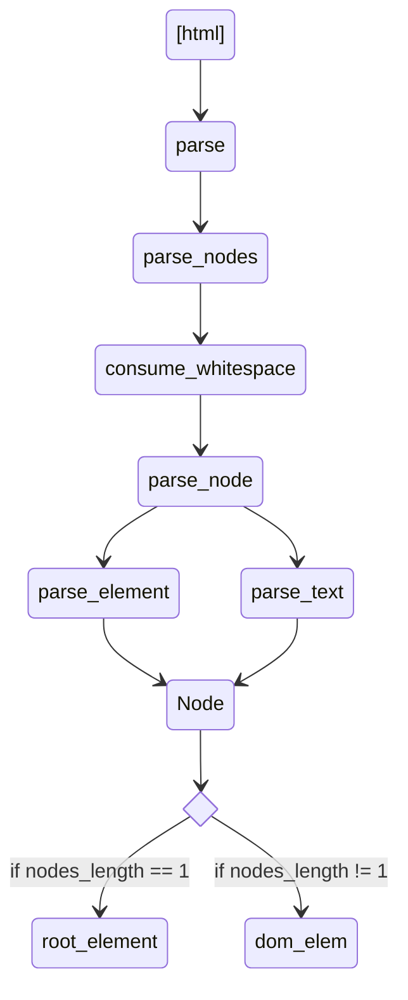
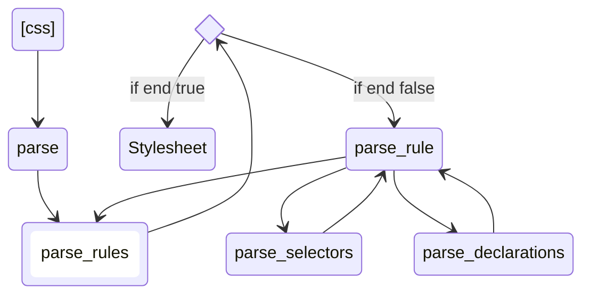

# lets-build-a-browser-engine

[Let's build a browser engine!](https://limpet.net/mbrubeck/2014/08/08/toy-layout-engine-1.html)を読んで、ブラウザエンジンを作ってみる。

  <image src="https://limpet.net/mbrubeck/images/2014/pipeline.svg" />

## Part1 & Part2

HTML の文字列を受け取って、DOM ツリーを構築する。

## part3

タグ名、ID、'.'で始まる任意の数のクラス名をサポートする。

## part4

DOM ツリー内の各ノードはスタイル ツリー内に正確に 1 つのノードを持ちます。
スタイル ツリーを構築する最初のステップは、セレクタのマッチングです。
単純なセレクタが要素にマッチするかどうかは、要素そのものを見ればわかります。
複合セレクタをマッチさせるには、DOM ツリーを走査して要素の兄弟や親などを調べる必要があります。

## part5 & part6

スタイル ツリーを 2 次元空間の矩形に変換するレイアウト モジュール。
layout モジュールの入力はパート 4 のスタイルツリーで、出力はさらに別のツリーのレイアウトツリーです。

## References

記事

- [「Let's build a browser engine!」を読んで Rust で簡易レンダリングエンジンを作った](https://dackdive.hateblo.jp/entry/2021/02/23/113522)

  - [Inside look at modern web browser (part 3)](https://developer.chrome.com/blog/inside-browser-part3/)
  - https://github.com/zaki-yama/rust-toy-browser-engine

- [Populating the page: how browsers work](https://www.linkedin.com/pulse/understanding-browser-rendering-critical-path-divyansh-singh/)

- [How browser rendering works — behind the scenes](https://blog.logrocket.com/how-browser-rendering-works-behind-scenes/)

- [Populating the page: how browsers work](https://developer.mozilla.org/en-US/docs/Web/Performance/How_browsers_work)

- [Deno で簡易レンダリングエンジンを作ってみた](https://zenn.dev/ryo_kawamata/articles/920baf76bfdf2e)

- [How web browsers work - parsing the HTML (part 3, with illustrations)](https://dev.to/arikaturika/how-web-browsers-work-parsing-the-html-part-3-with-illustrations-45fi)

実装

- [robinson](https://github.com/mbrubeck/robinson)

- https://github.com/qnighy/htstream
  - [HTML パーサーの設計・実装ノート (1) 字句解析](https://zenn.dev/qnighy/articles/0c9a49fd00069a)
  - [HTML パーサーの設計・実装ノート (2) 構文解析](https://zenn.dev/qnighy/articles/1a6ec268986cfd)

その他

- https://shikiyura.com/2022/08/install_the_multiple-runtime-versions_management_tool__asdf/
- [Eliminate content repaints with the new Layers panel in Chrome](https://blog.logrocket.com/eliminate-content-repaints-with-the-new-layers-panel-in-chrome-e2c306d4d752/?gi=cd6271834cea)
